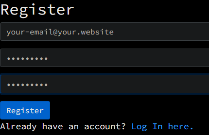
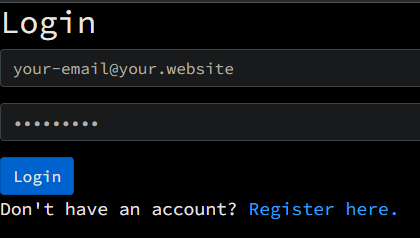
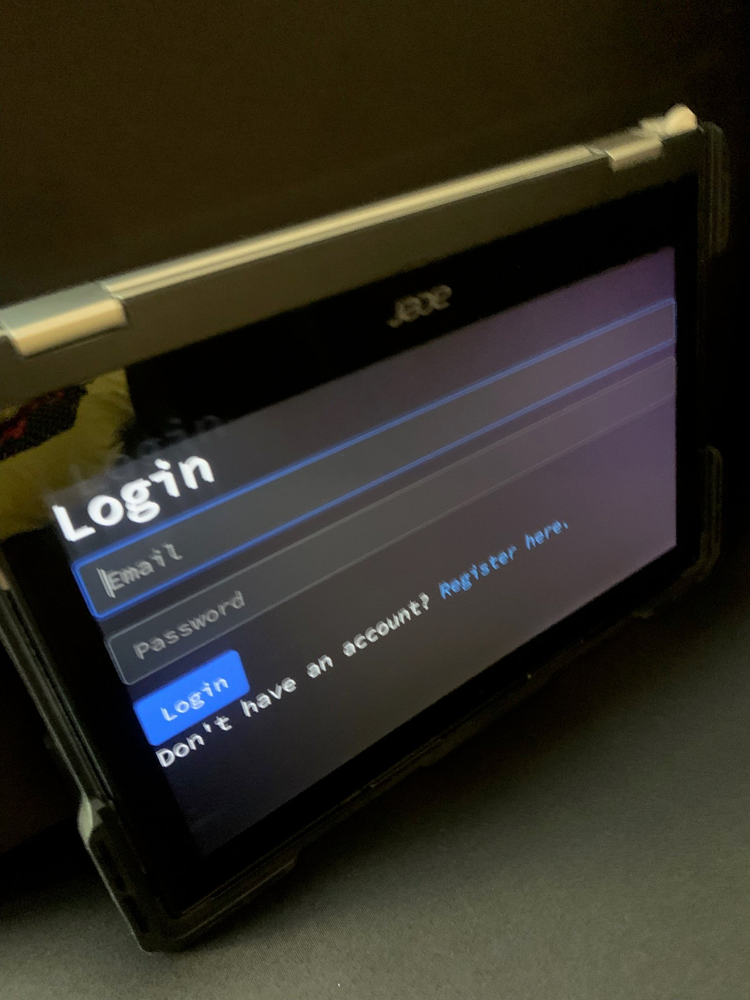

# An Online Terminal

---

This is a bit of code I wrote to pay homage to the main-frame programmers of old, and I mean even older than my mother! After all, the internet didn’t exist and the most popular languages were Assembly, COBOL and FORTRAN.

I wanted to show how, with a bit of code, I could emulate some of my grandparent’s generation of inputting data by creating a very basic terminal emulator but using 21st century innovations such as Python, JavaScript, Django, and React.

# Safety

---

This is an example application. Feel free to use it, but it is provided as-is.

Every user gets their own temporary directory, and I have done my best to make sure that the casual user cannot access any files outside of their temporary directory. However, I cannot guarantee that a more advanced user cannot access information outside of their directory.

# Installation

---

This project uses [Python](https://www.python.org/) > 3.8 and [Django](https://www.djangoproject.com/).

To install the dependencies, make sure you have python installed, and run the following command:

```
$ python3 -m pip install django
```

# Running

---

To emulate the Big Iron of old, we will be using a webserver.

To start the webserver, run the following command:

```bash
$ python3 manage.py runserver
```

# How Do I Use It?

---

> ### If you do not have an account, you will need to create one. We require registration because we create temporary directories on a per-user basis:



> ### If you already have an account, you will be redirected to the login prompt:



> ### Then, you will be redirected to the terminal:


Once you access the terminal you can:

-   Execute commands in a command shell/tty session on the server e.g. `dir`/`ls` or `mkdir`, just like they did in the old days
-   Use the <kbd>Arrow-Up</kbd> key to use the previous command (command history)

# What's Inside?

---

> This project uses Django, which has a lot of extra files that I haven't edited. So, I'm not going to include them in this overview of files.

In [final_project/static/index.js](./final_project/static/index.js) is the main JavaScript code. It uses ReactJS and BabelJS to render the webpage. When the user wants to execute a command, it sends the command to the server at `/execute`, which then executes it.

In [final_project/views.py](./final_project/views.py) is the server side code. It handles the requests from the client side, and executes the commands. It only contains 2 custom functions: `execute` and `command_history`. `execute` is the function that executes the command in your OS's preferred shell, and `command_history` is a function that allows you to retrive previously entered commands.

In [final_project/static/styles.css](./final_project/static/styles.css) is the CSS code. It contains the styles for the webpage. It uses a black background, white text, and Source Code Pro as the font to give the complete look of the terminal.

# API

---

The API to login, register, logout, execute commands and get the command history for a user.

> ### `POST` /login
>
> Login as a specific user.

Expected request (`multipart/form-data`):

```yaml
username: string
password: string
```

Example request (`multipart/form-data`):

```yaml
username: myusername
password: mypassword
```

Expected response:

-   you get redirected to the terminal

> ### `POST` /register
>
> Register a new user.

Expected request (`multipart/form-data`):

```yaml
username: string
password: string
```

Example request (`multipart/form-data`):

```yaml
username: myusername
password: mypassword
```

Expected response:

-   you get redirected to the terminal

> ### `POST` /logout
>
> Logout the current user.

expected response:

-   you get redirected to the login page

> ### `POST` /execute
>
> Executes a command **in the shell** and returns the output. User must be authenticated.

Expected request (`text/plain`):

```
{command}
```

Example request (`text/plain`):

```
echo Hello, World!
```

Expected response (`application/json`):

```json
{
    "output": string,
    "success": boolean,
    "command_history": list<string>
}
```

Example response:

```json
{
    "output": "Hello, World!",
    "success": true,
    "command_history": ["echo Hello, World!"]
}
```

> ### `GET` /command_history
>
> Gets a user's command history. User must be authenticated.

Expected response (`application/json`):

```json
{
    "commands": list<string>
}
```

Example response:

```json
{
    "commands": ["echo Hello, World!"]
}
```

# Distinctiveness and Complexity

---

I believe that my submission is more complex than other projects I have created because:

-   I created custom styles for the terminal
-   I utilized more than one Django model
-   I utilized Python's built-in `subprocess` API
-   I utilized JavaScript's `fetch` API to access the API
-   I utilized ReactJS and BabelJS to render the webpage
-   I utilized JavaScript's event listener API
-   I made an application that is mobile responsive



All to create a nostalgic feel for the old days of those who came before me.
